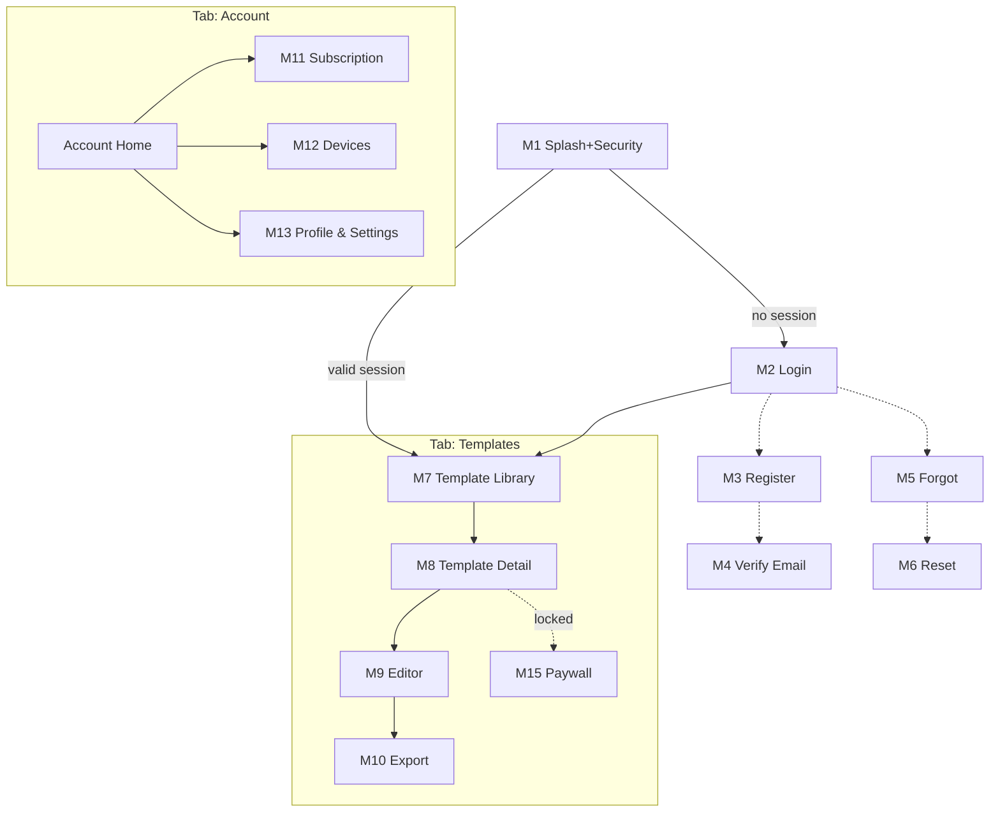
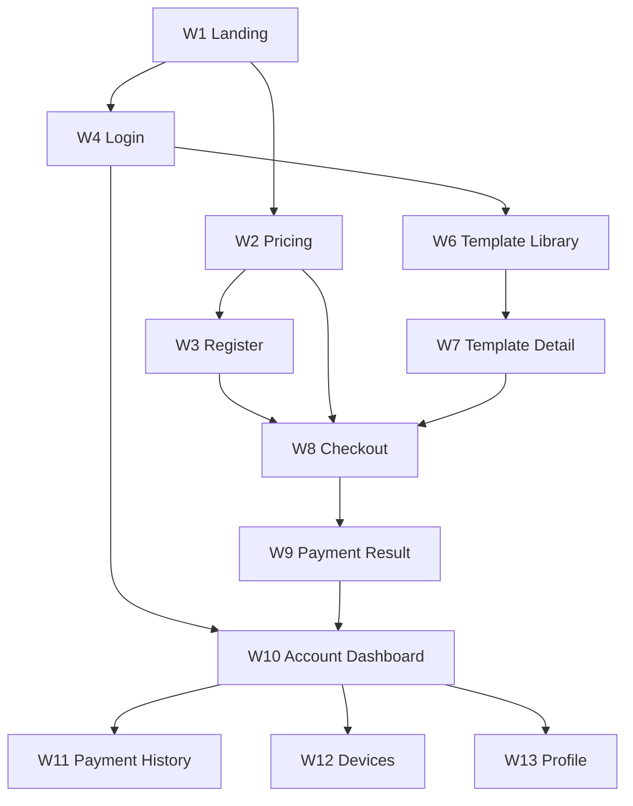
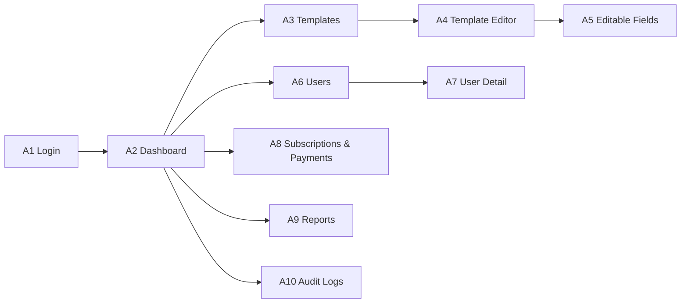

# ClipCart — UX Flows, Screens & Information Architecture

> Phase 2 deliverable. Purpose: give developers the exact **screen list, navigation and user journeys** to build against. No visual design here (that's Phase 3/4). Every screen maps to an approved requirement (FR-1…FR-20). No new features, no product decisions.

---

## 1. Platform responsibilities (recap, for orientation)

| Platform | Does | Does NOT |
|----------|------|----------|
| **Mobile App** (Android/iOS) | Browse, edit, **export MP4 on-device**, manage account/devices. | Purchase (read-only billing). |
| **Website** (Flutter Web) | Marketing, **purchase via Binance Pay**, account, browse templates + previews. | **No editing, no customization, no FFmpeg/rendering, no MP4 export** (mobile-only, locked). |
| **Admin Panel** (Flutter Web) | Manage templates, editable fields, users, devices, subscriptions, reports, audit logs. | End-user features. |

---

## 2. Mobile App

### 2.1 Screen list
| # | Screen | Requirement | Notes |
|---|--------|-------------|-------|
| M1 | Splash + security check | Security | Runs root/jailbreak/tamper + SSL checks; routes to auth or home. |
| M2 | Login | FR-2 | Email + password. |
| M3 | Register | FR-1 | Triggers email verification. |
| M4 | Verify Email (notice) | FR-1 | "Check your inbox" + resend. |
| M5 | Forgot Password | FR-3 | Request reset link. |
| M6 | Reset Password | FR-3 | From emailed token link. |
| M7 | Template Library (Home) | FR-10 | Grid + search + category filter. |
| M8 | Template Detail | FR-11 | Preview video, description, "Edit" (subscriber) / locked state. |
| M9 | Editor | FR-12, FR-13 | Edit enabled fields, live on-device preview. |
| M10 | Export | FR-14 | Progress + save/share result; enforces export limit. |
| M11 | Subscription Status | FR-8 | Read-only: current plan, expiry, exports left, "Renew on website". |
| M12 | Devices | FR-15, FR-16 | List devices, remove a device. |
| M13 | Profile & Settings | FR-4 | Edit profile, change password, theme, notifications, logout. |
| M14 | Notifications | FR-17 | In-app notices (expiry, export/device limits). |
| M15 | Locked / Paywall state | BR-2 | Shown when action needs an active subscription; points to website. |

### 2.2 Navigation
Bottom navigation = **2 tabs** (Templates, Account). Editor/Export are pushed screens. Notifications = app-bar icon.

---

## 3. Website (Flutter Web)

### 3.1 Screen list
| # | Screen | Requirement | Notes |
|---|--------|-------------|-------|
| W1 | Landing / Home | — | Product intro, CTA to pricing/register. |
| W2 | Pricing / Plans | FR-5 | Plans (placeholder prices), CTA to checkout. |
| W3 | Register | FR-1 | Email verification. |
| W4 | Login | FR-2 | — |
| W5 | Verify Email / Forgot / Reset | FR-1, FR-3 | Same as mobile equivalents. |
| W6 | Template Library | FR-10 | Browse + search/filter (previews). |
| W7 | Template Detail | FR-11 | Preview + subscribe CTA if not subscribed. |
| W8 | Checkout | FR-6, FR-7 | Creates Binance Pay order → pay → waits for verified activation. |
| W9 | Payment Result | FR-7, FR-9 | Success/pending/failed; success after backend verification only. |
| W10 | Account Dashboard | FR-8 | Subscription status, renew. |
| W11 | Payment History | FR-9 | List of verified payments. |
| W12 | Devices | FR-15, FR-16 | View/remove devices, buy extra slot. |
| W13 | Profile & Settings | FR-4 | Edit profile, change password, theme, logout. |
| W14 | Support / Contact | — | Static informational/contact page. *(Pending Client Confirmation — no FR yet; simple static page if desired.)* |

> **Website is browse + purchase + account only.** It never edits, customizes, renders or exports video. Template previews are the low-res/watermarked versions only.

### 3.2 Navigation
Top nav (public): Home · Pricing · Login/Register. Authenticated app-shell: Library · Account (with sub-sections).

---

## 4. Admin Panel (Flutter Web)

### 4.1 Screen list
| # | Screen | Requirement | Notes |
|---|--------|-------------|-------|
| A1 | Admin Login | FR-18 | Role-gated (`admin`). |
| A2 | Dashboard | FR-20 | Key numbers: active subscribers, revenue (USDT), exports, signups. |
| A3 | Templates List | FR-18 | Search, publish/unpublish, delete. |
| A4 | Template Editor | FR-18 | Upload assets (template, preview, thumbnail), metadata, categories/tags. |
| A5 | Editable Fields Config | FR-18 | Per template: choose editable fields, defaults, constraints. |
| A6 | Users List | FR-19 | Search users. |
| A7 | User Detail | FR-19 | Subscription adjust, suspend, view devices, **revoke device**. |
| A8 | Subscriptions & Payments | FR-20 | List verified payments/subscriptions. |
| A9 | Reports | FR-20 | Subscribers, revenue, exports, signups over time. |
| A10 | Audit Logs | FR-20 | Sensitive-action log viewer. |

### 4.2 Navigation
Left sidebar: Dashboard · Templates · Users · Payments · Reports · Audit Logs.

---

## 5. Core User Journeys

Only the journeys developers will actually build/test (align with the critical journeys in the testing scope).

**J1 — Register & verify (mobile/web)**
1. Register (email + password) → 2. Backend creates unverified account, sends verification email → 3. User clicks link → 4. Account verified → 5. Login allowed.

**J2 — Login with device binding (mobile)**
1. Enter credentials → 2. Backend validates → 3. Register/identify device → 4. If active devices < 2 → issue tokens, enter app. 5. If already 2 → show devices screen → remove one **or** buy extra slot on web → then proceed.

**J3 — Subscribe / pay (web only)**
1. Choose plan → 2. Backend creates Binance Pay order → 3. User pays in Binance Pay → 4. Binance sends signed webhook → 5. Backend verifies signature (idempotent) → 6. Subscription activated → 7. Confirmation email + dashboard shows active. *(Payment Result screen never marks success from frontend state — only after backend confirms.)*

**J4 — Browse → edit → export (mobile)**
1. Open Library → 2. Open Template Detail → 3. If active subscription + exports left → open Editor → 4. Edit enabled fields with live preview → 5. Tap Export → 6. Re-validate auth + subscription + device + export limit → 7. FFmpeg renders MP4 on-device → 8. Save/share; decrement export count.

**J5 — Renew after expiry**
1. Subscription expires → premium locks → 2. App shows locked state → "Renew on website" → 3. User renews on web (J3) → 4. On verified payment, access auto-restored.

**J6 — Manage devices**
1. Open Devices → 2. See device list (OS, app version, last active) → 3. Remove a device → that device's session is invalidated on next protected request.

**J7 — Admin publish template**
1. Admin login → 2. Create template → upload assets + metadata → 3. Configure editable fields (defaults/constraints) → 4. Publish → template appears in library.

---

## 6. Information Architecture (sitemaps)

**Mobile:** `Auth (Login/Register/Verify/Forgot/Reset)` → `App [ Templates → Detail → Editor → Export ] · [ Account → Subscription · Devices · Profile/Settings · Notifications ]`

**Website:** `Public [ Home · Pricing · Login/Register ]` → `Account [ Dashboard · Payment History · Devices · Profile ] · Library [ Browse · Detail · Checkout · Result ]`

**Admin:** `Login` → `Dashboard · Templates [List · Editor · Editable Fields] · Users [List · Detail(+Devices)] · Subscriptions & Payments · Reports · Audit Logs`

---

## 7. Pending Client Confirmation
1. **Support / Contact page (W14):** include a simple static page at launch, or omit?
2. **Extra-device-slot purchase (W12):** confirm it's a web purchase via Binance Pay (same flow as J3) at launch, vs a manual admin action.

---

## 8. Notes for developers
- Every protected screen (M8→M10, library edit/export, account) re-checks **auth + subscription + device + authorization** server-side; UI states are convenience only.
- In-app notices (M14) are driven by backend flags (subscription status, export/device limits) — no push infrastructure added.
- Screen IDs (M#, W#, A#) are the stable reference used in Phase 4 UI and in test cases.
